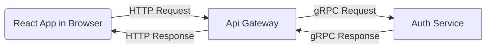

<div align="center">
  
</div>
<h1 align="center">easygenerator-api</h1>

<p align="center">
EasyGenerator API is a backend service built using NestJS and TypeScript, following a microservices architecture within a NestJS monorepo. The project leverages Docker for containerized deployment and Docker Compose for service orchestration.
</p>

## Overview

Although the task only required a module for authentication and not a microservices api I took an opportunity to present more of my skills. While adhering to the production grade requirments as mush as possible and as required in the task, I must say this is definitely an architecture overkill for the required service.

The API consists of the following microservices:

- **API Gateway**: Handles HTTP requests and proxies them to the appropriate microservices. It communicates with the Auth service using gRPC.
- **Auth Service**: Manages authentication and authorization for the API.

## Architecture



## Getting Started

### Prerequisites

Ensure you have the following installed:

- [docker](https://www.docker.com/)
- [docker compose](https://docs.docker.com/compose/)
- [node v20](https://nodejs.org/)
- [yarn](https://yarnpkg.com/)

### Environment Variables

Provide the necessary environment variables in a `.env` file. Example:

```env
NODE_ENV=local

# Frontend website url
WEBSITE_URL=http://localhost:3000

# Auth Service
AUTH_SERVICE_GRPC_HOST=localhost
AUTH_SERVICE_GRPC_PORT=50051

MONGO_DB_URI=mongodb://localhost:27017/auth
MONGO_DB_AUTHSOURCE=admin
MONGO_DB_USERNAME=root
MONGO_DB_PASSWORD=12345678

AUTH_SERVICE_ISSUAR_NAME=auth.easygen.service
ACCESS_TOKEN_SECRET=I_am_thinking_of_reasons_to_go_to_Switzerland_The_flag_is_a_big_plus
REFRESH_TOKEN_SECRET=Time_flies_like_an_arrow_Fruit_flies_like_a_banana
RESET_PASSWORD_TOKEN_SECRET=Where_do_generals_keep_their_armies?_In_their_sleevies!
ACCESS_TOKEN_EXPIRY_SEC=900
REFRESH_TOKEN_EXPIRY_DAYS=7d
RESET_PASSWORD_TOKEN_EXPIRY_SEC=900
PASSWORD_HASH_ROUNDS=10

# API Gateway Service
API_GATWAY_PORT=3001
CROSS_ORIGIN_PATTERN=http://localhost:3000
CROSS_ORIGIN_METHODS=GET,HEAD,PUT,PATCH,POST,DELETE
CROSS_ORIGIN_PREFLIGHT_CONTINUE=false
CROSS_ORIGIN_OPTIONS_SUCCESS_STATUS=204
AUTH_SERVICE_URL=localhost:50051
ENABLE_SWAGGER=true
```

### Running the Application using Docker Compose

1. Start the services using Docker Compose:

   ```sh
   docker compose --profile app up --build
   ```

   The API Gateway will be accessible at `http://localhost:3001` as configured in the environment variables

   Note: Some of the environment variables are overridden in the docker-compose.yml file to insure running smoothly, please check them for more insights

### Running the Application manually

1. Start the database only using Docker Compose:
   ```sh
   docker compose --profile tools up
   ```
2. Install dependencies:
   ```sh
   yarn install
   ```
3. Run the `api-gateway` service in a new terminal

   ```bash
   # development watch mode
   $ yarn run start:dev api-gateway
   ```

   The API Gateway will be accessible at `http://localhost:3001` as configured in the environment variables

4. Run the `auth` service in a new terminal
   ```bash
   # development watch mode
   $ yarn run start:dev auth
   ```

## API Documentation

- Swagger API documentation is available at `http://localhost:3001/swagger-api`.
- A Postman collection with predefined environment variables is provided for testing the API.

## Todos and Requirments for production deployment

- Secure the communication between the `api-gateway` and `auth` services
- Fine tunning the rate limiter on the endpoints (only added a general one)

## Stay in touch

- Author Github - [MartinEmilEshack](https://github.com/MartinEmilEshack)
- LinkedIn - [martin-emil](https://www.linkedin.com/in/martin-emil/)
- Facebook - [Martin.Emil.Eshack](https://www.facebook.com/Martin.Emil.Eshack)
